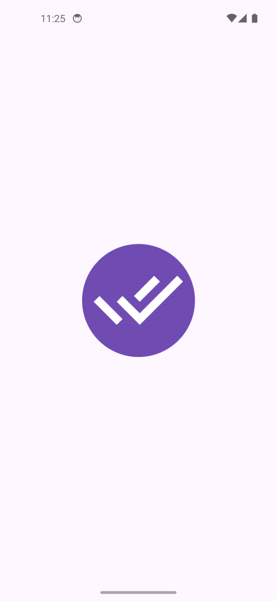
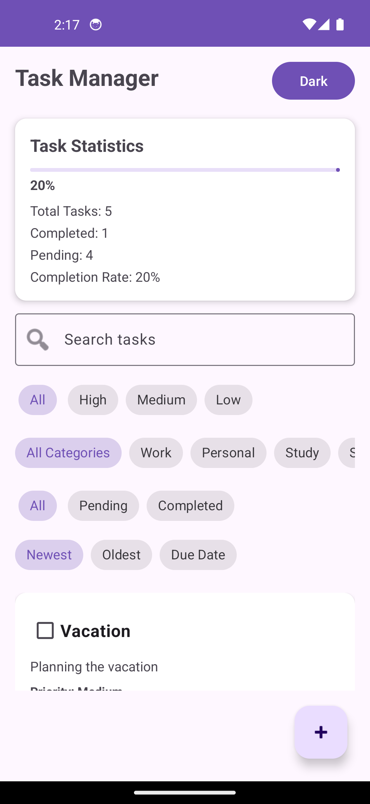
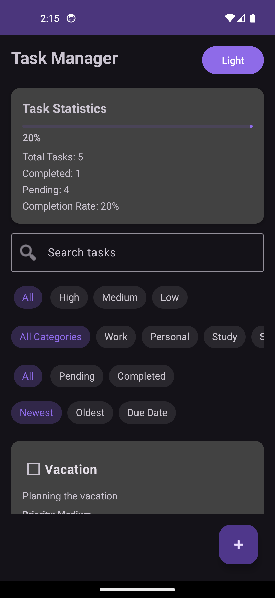
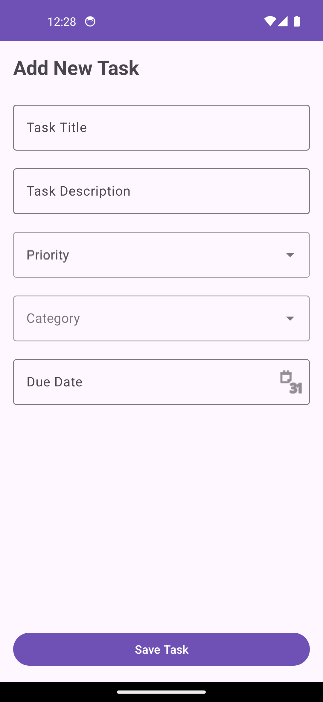
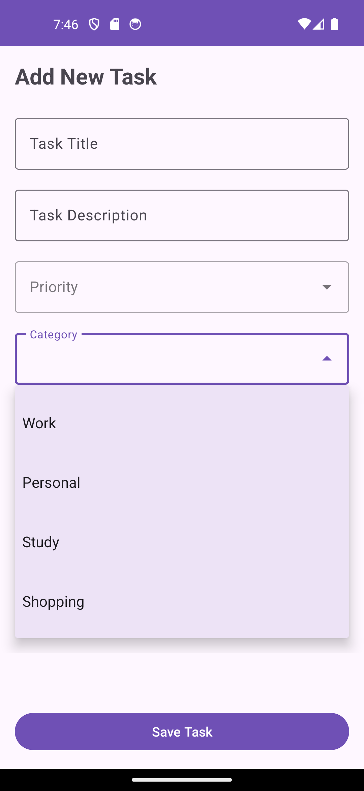
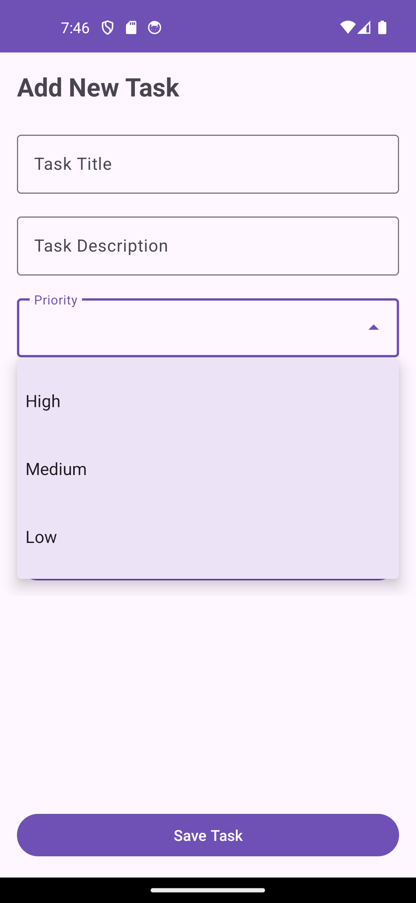
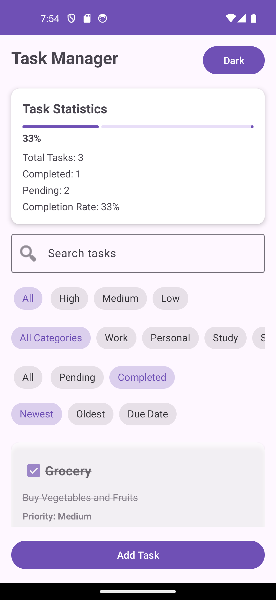
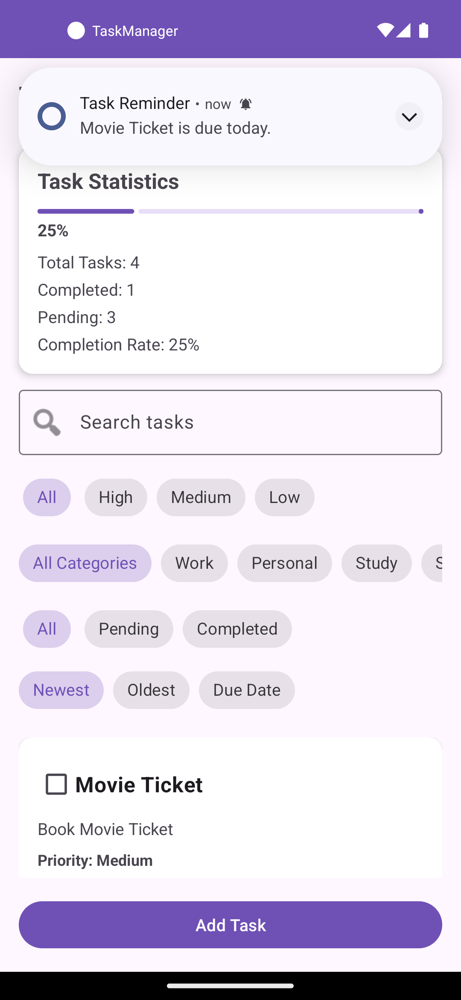
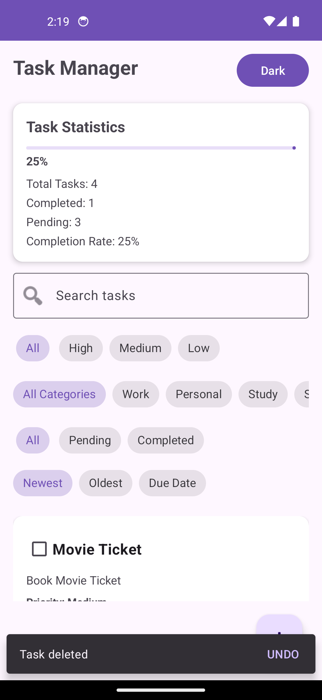

<p align="center">
  
</p>

# 📋 Task Manager App

A modern Android Task Manager application built using **Kotlin**, **MVVM Architecture**, **Room Database**, and **WorkManager**.

This app helps users create, organize, track, and manage daily tasks efficiently with reminders, priority levels, categories, task statistics, and dark mode support.

---

## 🚀 Features

### ✅ Task Management

* Add new tasks
* Edit existing tasks
* Delete tasks
* Swipe to delete tasks
* Undo deleted tasks
* Mark tasks as completed
* Track pending tasks

### 🎯 Task Organization

* Priority Levels:

    * High
    * Medium
    * Low
* Categories:

    * Work
    * Personal
    * Study
    * Shopping

### 🔍 Search & Filtering

* Search tasks by title
* Filter by priority
* Filter by category
* Filter by status
* Sort by:

    * Newest
    * Oldest
    * Due Date

### ⏰ Reminders & Notifications

* WorkManager integration
* Due date reminders
* Local notifications

### 📊 Statistics Dashboard

* Total Tasks
* Completed Tasks
* Pending Tasks
* Completion Percentage

### 🌙 User Experience

* Dark Mode Support
* Material Design UI
* Responsive Layout
* RecyclerView Task List

### 💾 Local Storage

* Room Database
* Persistent task management
* Offline functionality

---

## 🛠 Tech Stack

* Kotlin
* Android SDK
* MVVM Architecture
* Room Database
* LiveData
* ViewModel
* RecyclerView
* WorkManager
* View Binding
* Material Design Components

---

## 🏗 Architecture

This project follows the MVVM (Model-View-ViewModel) architecture pattern.

```text
UI (Activities)
      ↓
ViewModel
      ↓
Repository
      ↓
Room Database
```

---

## 📸 Screenshots

### Home Screen (Light Mode)



### Home Screen (Dark Mode)



### Add Task Screen



### Category Selection



### Priority Selection



### Task Completion Tracking



### Task Reminder Notification



### Swipe Delete + Undo



---

## 📂 Project Structure

com.sanju.taskmanager

├── adapter

├── database

├── model

├── repository

├── viewmodel

├── worker

├── MainActivity

└── AddTaskActivity

---

## Download APK

[Download Latest APK](https://github.com/sanjup143/TaskManager-Android-App/releases)

---

## Installation

1. Clone the repository

```bash
git clone https://github.com/sanjup143/TaskManager-Android-App.git
```

2. Open the project in Android Studio

3. Sync Gradle

4. Build and run the application


## 🎯 Learning Outcomes

This project demonstrates:

* MVVM Architecture
* Room Database Integration
* WorkManager Scheduling
* RecyclerView Implementation
* Local Notifications
* Search & Filtering Logic
* Swipe To Delete using ItemTouchHelper
* Snackbar Undo Actions
* Dark Mode Support
* Modern Android Development Practices
---

## 👨‍💻 Developer

**Sanju Parmar**

Android Developer | Kotlin | MVVM | Room | WorkManager

GitHub: [@sanjup143](https://github.com/sanjup143)

---

## Project Status

Completed Android Task Manager application built with Kotlin, MVVM Architecture, Room Database, WorkManager, Local Notifications, Search & Filtering, Statistics Dashboard, Dark Mode, and Swipe To Delete functionality.

This project was developed as a portfolio application to demonstrate modern Android development practices and productivity-focused application design.

---

## ⭐ If you like this project

Give this repository a star on GitHub.
